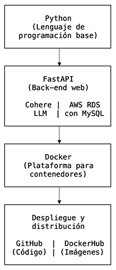

# **"KUH, ASISTENTE VIRTUAL"**
```
Proyecto de Data Engineering, febrero 2026
```

**Antecedentes**
```
Falúa Móvil es una ficticia tienda de telefonía móvil que abrió sus puertas en Aranjuez (Madrid) allá por octubre de 2024. Tras un primer año de apertura sus responsables quieren diferenciarse de la competencia local, más arraigada en el comercio tradicional, y añadir un valor tecnológico a su modelo de negocio. 
```

**Necesidad del cliente**
```
Falúa Móvil va a hacer una inversión en renovar y actualizar su página web, con el deseo de potenciar su e-commerce y, como valor añadido diferencial, querrían implementar a KuH, un asistente virtual para atención al cliente. Inicialmente KuH sólo estará disponible para usuarios registrados, con un doble enfoque de fidelización de cliente actuales y captación de nuevos usuarios.
```

**KPIs**
```
Incremento del número de clientes registrados, aumento de la tasa de conversión (entendiendo a esta como "usuarios que compran un móvil"/"personas que visitan la web" y multiplicando este resultado por 100 ) en el e-commerce, uso e interacción con el asistente virtual KuH.
```

**Diagrama de flujo del proceso**
```
```

```
KuH se basa en Python como lenguaje de programación principal.
El back-end está desarrollado en FastAPI, un framework web de alto rendimiento para la construcción de APIs RESTful.
La capa de IA utiliza un Modelo de Lenguaje de Gran Tamaño (LLM) de Cohere, integrado para procesamiento y generación de lenguaje natural.
La persistencia de datos se gestiona a través de Amazon Web Services (AWS) RDS, utilizando MySQL como sistema de gestión de bases de datos relacional.
La aplicación se containeriza en Docker, plataforma que asegura portabilidad y funcionalidad en cualquier entorno.
Las imágenes de contenedor se almacenan y comparten desde DockerHub, mientras que el control de versiones, integración continua y distribución del código fuente se realizan a través de GitHub.
```

**Estructura del proyecto provisional**
```
📁 KuH
│
├── .env (oculto)
├── .gitignore (oculto)
├── data/
│   ├── diagramas_KuH.docx              
│   ├── kuh_ene26.csv         
│   ├── Mobiles Dataset (2025).csv
├── Ejemplo de conversación con KuH_1.pdf
├── Ejemplo de conversación con KuH_2.pdf
├── images/
│   ├── diagrama_desarrollo_KuH_s.png
│   ├── diagrama_desarrollo_KuH_s.png
│   ├── image.png
├── kuh_presentacion.pptx
├── kuh.dockerignore
├── main.py
├── presentación_KuH.pdf
├── proyecto_kuh.ipynb
├── README.md
├── requirements.txt
├── streamlit.py
└── test.py
```

**Requisitos para una completa ejecución**
```
--OPCIÓN 1: desde GitHub--

- Python 3.11. 
- Un Jupyter Notebook para ejecutar el procesamiento de datos. 

Para instalar dependencias, ejecutar:

En Linux o Mac:
!pip3 install -r requirements.txt

En Windows:
pip install -r requirements.txt

Para ejecutar la solución desde terminal, sea cual sea el sistema operativo:
streamlit run streamlit.py


--OPCIÓN 2: desde Docker--
Disponible a mediados de febrero de 2026.

```
**Autor**
```
Félix de Molina


```
**Licencia** 
```
CC BY NC

```

**Nota del autor**: 
```
KuH es completamente funcional hasta el sábado 28 de febrero de 2026. A partir de esa fecha, cualquier persona que desee probar la solución habrá de crear y configurar su propia base de datos relacional en un servicio como Amazon Web Services RDS o similar. 
```
